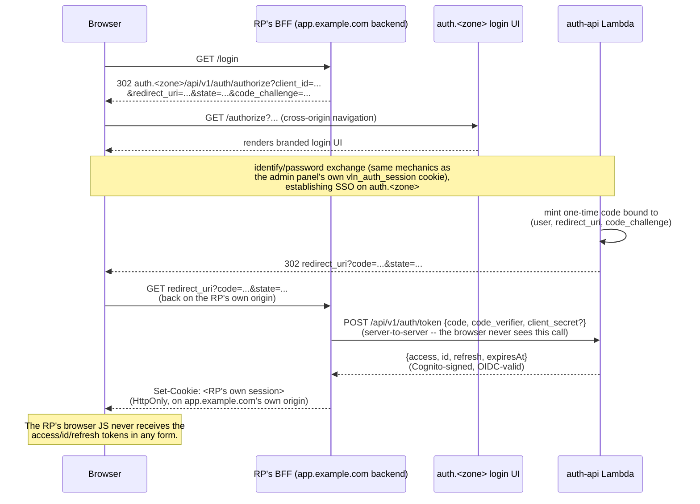

# Plan: vendor-neutral authentication

## Goal

The frontend must not know it is talking to Cognito. Today the auth-site SPA
constructs raw Cognito JSON-RPC calls (`X-Amz-Target: ...InitiateAuth`, the
`AWSCognitoIdentityProviderService` request/response shapes, `USER_PASSWORD_AUTH`
flow) and posts them at `/api/v1/idp`. That hard-couples the UI to Cognito and
blocks ever moving to (or federating with) another identity provider without a
frontend rewrite.

Replace the direct-to-Cognito proxy with a **first-party auth API** the SPA
talks to in vendor-neutral terms. Cognito becomes one implementation detail
behind that API, swappable later without touching the frontend.

## Target UX flow (identifier-first)

1. **User enters an identifier** (username or email) — pre-fillable from a
   remembered value in `localStorage`/cookie.
2. **Backend resolves the identity provider** tied to that account and tells
   the frontend how to proceed:
   - **Federated IdP** → the identify response tells the frontend to make a
     **top-level browser navigation** to a same-origin endpoint
     (`/api/v1/auth/federation/start`), which answers with a **real `302`** to
     the external IdP. The frontend does not know the vendor and never handles
     the cross-origin redirect itself — it just sets `window.location`.
   - **Local password** → the response tells the frontend to prompt for a
     password, which it submits back to the same API (a plain `fetch`, no
     navigation).
   - So: **`200`** carrying a next-step directive for both branches, and the
     federated branch's directive is "navigate to this same-origin URL," which
     is where the genuine **`302`** happens. See "Settled: redirect is a real
     302" below.

This is standard **home-realm discovery / identifier-first** login. Cognito's
own hosted **Managed Login cannot reproduce this UX** (it shows a single
combined username+password+IdP-buttons screen with no email-domain home-realm
routing), so keeping this flow **commits us to our own UI** driven by Cognito's
IDP API — see "Platform decision: own UI, not Managed Login" below, which is
the fork the rest of this plan resolves around.

### Signup may optionally offer other IdPs

Signup is not local-only. When federation providers are configured **and
flagged "offer at self-signup,"** the signup screen shows "Continue with
&lt;provider&gt;" buttons alongside the local email/password form — local
signup always remains available; the IdP buttons are additive and appear only
when such a provider exists (hence *optional*). Two ways a user reaches a
provider at registration time:

- **Explicit button** (a social/broad provider, no identifier typed yet):
  clicking "Continue with X" navigates straight to
  `/api/v1/auth/federation/start` for that provider with `intent=signup` — the
  same real-`302` machinery as login, just chosen directly instead of resolved
  from an identifier.
- **Domain-mapped, via identifier-first** (an enterprise realm): a user who
  types an email in a federated domain is redirected to their IdP by the login
  flow above; if no account exists yet, the callback **provisions one**
  (just-in-time), so "log in" and "sign up" converge for domain-bound realms.

Either way the federated callback, on a user that doesn't exist yet, runs the
same provisioning the local `post-confirmation` trigger does today (resolve
tenant, seed the initial role assignment), so a federated signup lands in the
exact same RBAC state as a local one.

## Platform decision: own UI, not Managed Login (resolved)

The one big fork behind everything below. Two ways to be OIDC-capable on top of
Cognito:

- **Cognito Managed Login** (its hosted pages) gives the full OIDC
  authorization endpoint and native federation for near-zero code — but it is a
  hosted redirect page, it can only be *themed* not *rebuilt*, and crucially it
  **cannot reproduce our identifier-first UX** (no email-domain home-realm
  discovery; combined single-screen form). Keeping our UX rules it out.
- **Own UI on the IDP API** (`InitiateAuth`/`AdminInitiateAuth`, what we do
  today) keeps our exact flow and stays frontend-vendor-neutral. The cost:
  Cognito's hosted-only features (the `/oauth2/authorize` endpoint and native
  federation) are unavailable, so **we build those interactive parts
  ourselves**.

**Decision (rlc): own UI.** Concretely that means:

1. **RP token delivery → BFF path.** The auth component is an authorization
   server with a slim, single-client-per-config `/authorize` + `/token`
   handoff (one-time code + PKCE, `redirect_uri` allowlist). The consuming app's
   backend (BFF) exchanges the code server-to-server and holds the tokens,
   setting its own httpOnly cookie on *its* origin. No token ever touches
   browser JS. This needs no Cognito hosted domain and no full OIDC-provider
   machinery (no client registry, no consent, no self-signed tokens — see
   below).
2. **Federation → self-driven, Cognito as directory.** Because Cognito-native
   federation is hosted-bound, the auth Lambda acts as the OIDC *client* to the
   external IdP itself (drives its `/authorize` + code exchange), then
   provisions/links the user in Cognito as a native directory record
   (`AdminCreateUser` + identity mapping). Cognito stops being the federator; it
   stays the user store.

### What Cognito still buys us under own UI (why keep it)

Even reduced to "own UI + thin handoff + self-driven federation," Cognito still
provides the **security-critical primitives you don't want to hand-roll**, so
the build stays small and the risk low:

- **Password storage & verification** (hashing/SRP/policies — the classic
  don't-roll-your-own surface).
- **Token signing + JWKS + key rotation.** `InitiateAuth` returns
  **OIDC-valid, Cognito-signed** ID/access tokens and Cognito publishes/rotates
  the JWKS. So our `/token` handoff **returns Cognito's tokens** — we are *not*
  a token-minting OP, not managing signing keys. This is what keeps "our own
  OIDC" thin.
- **MFA**, the **sign-up / email-verification / forgot-password state
  machines**, **advanced security** (compromised-credential/adaptive/lockout),
  **refresh-token lifecycle**, the **user directory + groups**, and our
  **Lambda triggers** (pre-token-generation for claims, post-confirmation for
  provisioning — the RBAC seam).

What Cognito *stops* buying us is exactly what we opt out of: the hosted UI, the
interactive `/oauth2/authorize` endpoint, and native federation. That narrows
its value to "a hardened credential store + token signer + auth state machines +
trigger hooks" — real value, but worth naming. The `/api/v1/auth` abstraction is
what preserves the exit: because the SPA and RPs speak *our* contract, the
engine behind it (Cognito today; Keycloak/Ory/WorkOS/… later) can be swapped
without touching the UI or the RPs.

## Proposed API contract (`/api/v1/auth`)

A new surface under the existing `/api/v1` prefix, served by a new **auth
Lambda** (sibling to the admin-api Lambda, same `aws/http_api` pattern, public
routes). It has three layers. Illustrative, to be firmed up.

**Layer 1 — RP-facing (the BFF handoff).** How a consuming app at another
origin gets tokens. This is the slim authorization-server surface.

- `GET /api/v1/auth/authorize`
  Query: `client_id`, `redirect_uri` (**matched against a config allowlist**),
  `state`, `code_challenge` (PKCE). Entry point the app's BFF sends the browser
  to. Runs the branded login UI below; on success mints a **one-time code**
  bound to `(user, redirect_uri, code_challenge)` and **`302`s back** to
  `redirect_uri?code=…&state=…`. (If the AS session cookie already proves an
  authenticated browser, this can complete **silently** — that's SSO.)
- `POST /api/v1/auth/token`
  Back channel, called server-to-server by the BFF (not the browser). Body:
  `{ code, code_verifier, client_secret? }`. Validates the one-time code + PKCE,
  returns the **Cognito-signed, OIDC-valid** `{ access, id, refresh, expiresAt }`.
  The BFF holds these and sets its own httpOnly cookie on its origin.

Unlike the admin panel (below), the RP's browser is never handed a bearer
token in any form — the `/token` exchange happens entirely server-to-server
between the RP's BFF and the auth Lambda, out of the browser's reach:

**Layer 2 — login-UI-facing (our SPA on `auth.<zone>`).** What `/authorize`
drives; the browser only ever talks to these same-origin.

- `POST /api/v1/auth/identify`
  Body: `{ "identifier": "jane@example.com" }`. The identify `session` JWS is
  returned as a short-lived `HttpOnly` cookie, not in the body.
  → `200 { "method": "password" }` — prompt for password.
  → `200 { "method": "redirect", "location": "/api/v1/auth/federation/start" }`
    — same-origin; the SPA does `window.location = location` (real `302`
    happens there, see decision below).
- `POST /api/v1/auth/password`
  Body: `{ "password": "..." }` (identify `session` rides its cookie).
  Verifies via `AdminInitiateAuth`, establishes the **AS session** cookie, and
  completes the pending `/authorize` request — responds
  `200 { "location": "<redirect_uri>?code=…" }` for the SPA to navigate to (or,
  for the same-origin admin panel, the AS session cookie alone suffices).
  → `200 { "challenge": "NEW_PASSWORD_REQUIRED" | "MFA_…", … }` for challenges
    (the backend owns challenge orchestration, not the SPA).
- `GET /api/v1/auth/federation/start` and `/federation/callback`
  **Self-driven federation** (Cognito is *not* the federator). `start` `302`s to
  the **external IdP's** `/authorize` (we are the OIDC client: our `client_id`,
  our `redirect_uri` = `/federation/callback`, `state`, PKCE — all in the signed
  `session`, which also carries `intent`). `callback` exchanges the code with
  the IdP, then provisions/links the user in Cognito as a directory record
  (`AdminCreateUser` + mapping) — running the same tenant-resolution +
  initial-role-assignment as local `post-confirmation` for a new user — and
  finally completes the pending `/authorize` (mint code → `302` to the RP).

**Layer 3 — self-service + lifecycle.**

- `GET /api/v1/auth/providers` — public; providers flagged "offer at
  self-signup" as `[{ id, label }]` so the signup screen knows which "Continue
  with …" buttons to render. Empty list → signup stays local-only.
- `POST /api/v1/auth/signup`, `/confirm`, `/forgot`, `/reset` — local
  registration/verification/password-reset (wrap Cognito's `SignUp` /
  `ConfirmSignUp` / `ForgotPassword` / …).
- `POST /api/v1/auth/refresh`, `POST /api/v1/auth/logout` — refresh (server-side
  via the BFF for RPs) and sign-out (clear AS session + `RevokeToken`).

Everything the SPA and the BFF exchange is a plain first-party JSON/redirect
shape. No `X-Amz-Target`, no Cognito response envelopes, no Cognito flow names —
the one place Cognito's own token *shape* surfaces is the `/token` response,
consumed by the first-party BFF, not the browser.

## What changes, by layer

**`node-vlinder-auth/packages/lambda-src`** — new `auth-api/` handler set across
the three layers: `authorize` / `token` (RP handoff), `identify` / `password` /
`federation-start` / `federation-callback` (login UI), and `signup` / `confirm`
/ `forgot` / `reset` / `refresh` / `logout`. It owns *all* Cognito interaction
(`AdminInitiateAuth` / `RespondToAuthChallenge` / `SignUp` / `ConfirmSignUp` /
`AdminCreateUser` / `RevokeToken`) **plus** the one-time-code store and the
role of **OIDC client to each external IdP** (self-driven federation — its own
`/authorize` redirect and code exchange, since Cognito-native federation is
hosted-bound). This is the single place that knows about Cognito. Published in
the same `@vln-devsecops/auth-lambda` package.

Identity-provider resolution (step 2) needs a lookup: identifier →
{ local | federated-provider }. Options, cheapest first:

- Email-domain → provider mapping (reuse the existing tenants table's
  `emailDomain` index, or a small dedicated map) for federated realms.
- Default to local password when no federation is configured (the common
  single-tenant case), so this stays zero-config until someone wires an IdP.

The **one-time authorization code** (Layer 1) needs a short-TTL store —
DynamoDB with a TTL attribute, keyed by the code, holding
`(user, redirect_uri, code_challenge, exp)`. The RP `client_id` →
`{ allowed redirect_uris, client_secret }` registry is small config (a table or
module variable), not a dynamic-registration system.

**`node-vlinder-auth/packages/auth-site`** — rip out the direct Cognito
calls in `main.tsx`/`authConfig.ts`. The SPA becomes: collect identifier →
`POST /auth/identify` → branch on `method` (prompt password vs navigate to
`location`) → on password, `POST /auth/password`. The SPA never holds tokens:
the **admin panel** rides the same-origin AS session cookie, and a **cross-origin
consuming app** gets tokens only through its BFF (Layer 1), never in browser JS.
`authConfig.ts`'s `buildInitiateAuthBody` / `parseAuthResult` (Cognito-shaped)
are deleted. `ui-auth` components stay mostly as-is (they already emit plain
`{ email, password }` callbacks); a new identifier-first entry component may be
warranted. The **signup screen** calls `GET /api/v1/auth/providers` and renders
a "Continue with …" button per returned provider above the local form (each →
top-level nav to `/api/v1/auth/federation/start?provider=<id>&intent=signup`);
empty list → signup is local-only.

**The consuming app's BFF** (the app team's code, not this repo) is the fourth
participant: it starts login by redirecting to `/authorize`, handles the
`redirect_uri` callback, calls `/token` server-to-server, and sets its own
httpOnly session cookie on the app's origin. Documenting that integration
(config: `client_id`, `redirect_uri`, `client_secret`) is part of this work.

**`terraform-modules/modules/aws/vlinder_auth`** —

- Add the auth Lambda + its `aws/http_api` routes under `/api/v1/auth`
  (public, no authorizer).
- Drop the `/api/v1/idp*` CloudFront behavior, the `idp_proxy_rewrite`
  function, and the direct-IDP custom origin entirely — the SPA no longer
  talks to `cognito-idp.<region>` at all; it only talks to `/api/v1/auth`,
  which is just more admin-api-style HTTP API. This actually *simplifies*
  the distribution (removes the whole `X-Amz-Target` allowlist workaround).
- The `auth_site` app client switches to `ADMIN_USER_PASSWORD_AUTH`, since auth
  now runs server-side in a Lambda with admin credentials rather than from the
  browser. **No Cognito user-pool (hosted) domain is created** — we don't use
  the `/oauth2/*` endpoints or native federation.
- Add the **one-time-code DynamoDB table** (TTL) and the **RP client registry**
  (`client_id` → allowed `redirect_uri`s + `client_secret` in Secrets Manager)
  for Layer 1, and the `identity_providers` table + provider secrets for
  self-driven federation.
- `config.json`: the SPA no longer needs `userPoolClientId` (the backend holds
  it) — runtime config may shrink to just the multi-tenant flag.

**e2e** — the flows are the same from the user's point of view (the whole
point), so the Playwright scenarios largely stand. The World's Cognito
`admin-*` setup/teardown stays (that's test scaffolding reaching past the
app deliberately, unaffected by how the app itself authenticates).

## Migration sequencing (keep it green throughout)

1. ✅ **Done.** Landed the auth Lambda + `/api/v1/auth` routes (`identify`,
   `password`) **alongside** the existing `/api/v1/idp` proxy.
2. ✅ **Done.** The whole SPA is on `/api/v1/auth`: sign-in via the two-step
   identifier-first flow (`SignInFlow` → `/auth/identify` then `/auth/password`),
   and signup / confirm / resend / forgot / reset via their `/auth/*` endpoints.
   No SPA code speaks Cognito (`X-Amz-Target`) any more. **Transitional:**
   `/auth/password` returns the tokens in the response body so the SPA keeps its
   current `sessionStorage` + Bearer flow (no worse than today — the
   httpOnly-cookie + cookie-authorizer switch is step 4).
3. ✅ **Done.** The SPA no longer calls `/api/v1/idp` at all, so the IDP proxy
   behavior, its CloudFront function (`idp_proxy_rewrite`), the Cognito-IDP
   custom origin, and the SPA's dead Cognito-shaped helpers
   (`buildInitiateAuthBody`/`parseAuthResult`) are removed. The `auth_site`
   client keeps only `ADMIN_USER_PASSWORD_AUTH` + refresh.
4. Add the **Layer-1 BFF handoff** (`/authorize` + `/token` + one-time-code
   table + RP client registry) and move the **admin API authorizer to read the
   AS session cookie**; prove it with a stub BFF RP in the e2e suite.
5. Add **self-driven federation** (`/federation/start` + `/federation/callback`,
   auth Lambda as OIDC client, Cognito-as-directory linking) as its own
   increment, with an e2e scenario against a stub OIDC provider (or a real test
   realm).

## Open questions to settle before building

- **Settled: redirect is a real 302.** Decision (rlc): the federated redirect
  is a genuine `302`, not a `200`-carrying-`location` that the SPA replays —
  handling a redirect inside the React app is brittle and finicky. Reconciled
  with the "can't read a cross-origin redirect out of `fetch`" concern by
  never `fetch`-ing the redirect: `identify` returns a **same-origin**
  `location` (`/api/v1/auth/federation/start`), the SPA does a top-level
  `window.location =` navigation to it, and *that* endpoint emits the real
  `302` to the external IdP, which the browser follows natively. React never has
  to catch or replay a cross-origin redirect.
- **Settled: session is a signed (JWS) self-contained token.** Decision (rlc):
  the `session` passed between `identify` → `password`/`authorize` is a signed
  **JWS** carrying the whole intermediate session state (resolved identifier,
  chosen `method`, resolved federated provider, PKCE/state for the authorize
  step, a short `exp`). Signed, not stored: the auth Lambda stays **stateless**
  — no session table — and the client cannot alter the state and keep it valid.
  Notes: JWS is signed, not encrypted, so its payload is readable by the client
  — put no secrets in it (the identifier is the user's own; that's fine), and
  keep the TTL short since it's an in-flight auth token. Signing key lives with
  the auth Lambda (KMS asymmetric key, or a Secrets Manager HS256 secret);
  KMS-asymmetric keeps the private key out of the function entirely. Transport:
  it's delivered as a short-lived `HttpOnly` cookie between the two steps, not
  in the response body (see token-storage decision), so it never touches JS
  either — httpOnly is just the transport; it remains a signed JWS.
- **Settled: federation is configured in the admin panel** (decision: rlc).
  Rather than a Terraform variable (redeploy per change, GitOps-declared), the
  domain→provider mapping is managed at runtime by admins, gated behind a new
  `federation:*` privilege. Proposed UX — a new **Identity Providers** section
  alongside Users/Roles:
  - **List:** each configured provider — display name, protocol (OIDC), the
    email domain(s) that route to it, enabled/disabled.
  - **Add / edit provider form:** display name; OIDC **discovery URL**
    (`…/.well-known/openid-configuration`); client id; **client secret**
    (write-only field — stored in Secrets Manager, never read back, rendered as
    "••• set" with a "replace" action); scopes; the email domain(s) mapped to
    this provider; and an **"offer at self-signup"** toggle (plus button label)
    that controls whether it appears as a "Continue with …" button on the
    signup screen — off by default, so domain-bound enterprise realms stay
    login-only unless an admin opts them in.
  - **Validation:** on save the auth/admin backend fetches the discovery URL to
    confirm it resolves, and enforces domain-mapping uniqueness (one domain →
    one provider).
  - **Enable/disable** toggle so a provider can be staged before it goes live.

  Storage: non-secret provider config in a new CMK-encrypted
  `identity_providers` table (in multi-tenant mode the domain mapping reuses the
  tenants table's existing `emailDomain` index that already resolves a user's
  tenant at signup); the **client secret in Secrets Manager**, referenced by
  ARN. The admin-api Lambda writes config + secret; the auth Lambda reads the
  mapping (and the secret, for the code exchange) at `identify`/`callback` time.
  Trade-off of admin-managed vs module-variable: runtime-editable with no
  redeploy and self-service per tenant, at the cost of a larger privileged
  write surface to secure (hence the dedicated `federation:*` privilege and
  write-only secret handling) — acceptable, and consistent with roles/users
  already being runtime-managed here.
- **Settled: token delivery is the BFF path.** The realistic browser threat is
  XSS, and that's what splits the storage options:
  - **`sessionStorage` (today's baseline).** Simple: the SPA reads the token
    and sets `Authorization: Bearer` itself, which is exactly what the admin
    API's API-Gateway JWT authorizer already expects. No CSRF exposure (nothing
    is auto-sent). *But* the token is readable by any JS on the page, so a
    single XSS exfiltrates it — worst for the long-lived refresh token.
  - **httpOnly cookie set by the backend.** `HttpOnly` puts the token out of
    JS's reach, so XSS can't read it — the main security win, and it matters
    most for the refresh token. Because the whole app is one first-party
    same-origin surface behind CloudFront (`/api/v1/*`), the cookie is sent
    automatically with no header plumbing in the SPA, and `SameSite=Strict` +
    `Secure` is fully viable (no legitimate cross-site use), which closes most
    of the CSRF exposure that cookies normally reintroduce; add a double-submit
    CSRF token on state-changing routes for belt-and-suspenders. Two real
    costs: (1) the admin API's JWT authorizer reads the `Authorization` header,
    not a cookie, so cookie sessions require either a Lambda authorizer that
    reads the cookie or an edge function that copies cookie→header — i.e. this
    is coupled to the authorizer-issuer item below and should land with it; and
    (2) a JWT in a cookie must stay under the ~4 KB limit (watch a large
    `permissions` claim).

  **Correction (rlc): the final auth tokens cannot be an auth-origin cookie.**
  The "one first-party same-origin surface" premise above holds only for the
  bundled admin panel. The auth component's actual job is to authenticate a user
  *for a consuming application at a **different** origin*, and a cookie scoped to
  `auth.<zone>` is exactly what `SameSite` + domain-scoping stop from ever
  reaching `app.<other-origin>`. So the post-login `access`/`id`/`refresh`
  tokens must be **delivered to the relying-party app cross-origin**, not set as
  an auth-origin cookie. The standard mechanism is an OAuth2/OIDC
  **authorization-code redirect (with PKCE)** back to the app's `redirect_uri`;
  the app receives the tokens and owns its own storage (ideally an httpOnly
  cookie on *its* origin via a BFF — but that is the RP's concern, not ours).

  What `auth.<zone>` legitimately *does* keep as httpOnly cookies (genuinely
  same-origin, never crossing to the RP):
  - the in-flight **identify JWS** (settled above), and
  - an **AS session cookie** — "this browser is authenticated at the auth
    component" — enabling SSO / silent re-auth so the user isn't re-prompted per
    app. This is emphatically *not* the RP's access/refresh token.

  This reframes the component as an **authorization server with its own branded
  login UI**, not a same-origin token vendor — and it revises the
  admin-API-authorizer coupling below: the admin panel is simply the one RP that
  happens to be same-origin (so it can ride the AS session cookie), whereas a
  general RP's API lives at its own origin and validates the delivered token
  itself.

  **Decision (rlc): the BFF path** (see "Platform decision" above and the
  Layer-1 contract). Tokens reach the different-origin consuming app via our
  slim `/authorize` + `/token` handoff (one-time code + PKCE, `redirect_uri`
  allowlist); the app's **BFF** holds them server-side and sets its *own*
  httpOnly cookie on the app's origin, so **no token touches browser JS on
  either origin** — the full XSS win, cross-origin. `auth.<zone>` keeps httpOnly
  cookies only for genuinely same-origin material (the identify JWS and the AS
  **session** cookie for SSO), never the RP's tokens.
  - *Requires* the consuming app to have a server-side component (a pure static
    SPA with no backend would need token-in-redirect / a public PKCE client
    instead — not our case).
  - Handles N *known* first-party apps via the `redirect_uri` allowlist, with
    SSO across them for free; it deliberately does **not** support arbitrary
    third-party clients (that would be the full-OIDC-provider build we rejected).
  - The **admin panel** is the one same-origin consumer and skips the BFF: it
    rides the AS session cookie directly (its API authorizer reads that cookie —
    see next item).
- **Correction (rlc): the client app's own back-end drives the redirect (the
  front-end just navigates to it), and the BFF hands the resulting access
  token back down to the front-end.** Revises the bullet above, worked out
  against a concrete scenario (a client app with no federation, front-end
  clicks "login"). Full worked example: a Gherkin scenario for this lives in
  this repo's authoring workspace, kept separate from this doc for now.
  1. **The front-end navigates to a same-origin route on its own app**
     (e.g. `app.domain/login`) — it never generates or holds PKCE material
     itself. That route is served by **the client app's own back-end**,
     which is the one acting as the (confidential) OAuth client: it mints
     `code_verifier` and `code_challenge = BASE64URL(SHA256(code_verifier))`
     (note the base64url encoding — a raw digest won't validate against a
     standard `/authorize` implementation), encrypts `code_verifier` plus a
     timestamp into a JWE used as the `state` parameter (JWE, not JWS —
     `code_verifier` needs *confidentiality*, not just tamper-evidence,
     since `state` round-trips through browser history/redirects, exactly
     the interception surface PKCE exists to defend against), and
     `302`-redirects the browser to `/authorize` with `client_id`,
     `redirect_uri`, `response_type=code`, `scope`, `state`,
     `code_challenge`, and **`code_challenge_method=S256`** (easy to omit;
     without it PKCE is ambiguous and some implementations default to the
     unsafe `plain` method).
  2. **The identify-session cookie carries the pending request forward.**
     This isn't new ground — it's exactly what the signed-JWS bullet above
     already anticipated ("carries... PKCE/state for the authorize step"),
     just made concrete: the existing `vln_auth_identify` JWS payload is
     extended to also hold `redirect_uri`, `code_challenge`, and the
     incoming `state` value across the identify → password steps, so
     nothing needs a server-side lookup to recall them.
  3. **On successful password validation**, the auth service reads
     `redirect_uri`/`code_challenge` back out of the identify-session JWS
     (self-contained, no lookup) and mints an **opaque one-time token**:
     `JWE({user, redirect_uri, code_challenge, timestamp})`. Deliberately
     *not* tracked server-side for single-use enforcement (decision: rlc) —
     the only party that can redeem it is whoever holds the matching
     `code_verifier`, which never left the client app's own back-end, so
     there's no external replay threat to defend against; the sole party
     capable of replaying it has no incentive to. It `302`s back to
     `redirect_uri?code=<token>&state=<the same state value, echoed back
     verbatim>`.
  4. **The client app's back-end extracts `code` and `state`** from its own
     callback route, decrypts `state` to recover `code_verifier`, and
     `POST`s `{code, code_verifier}` to `/api/v1/auth/token` — no need to
     also resend `redirect_uri` separately; it's already bound inside the
     encrypted `code` itself, which sidesteps the usual reason OAuth token
     requests repeat it (a plain opaque authorization code has no other way
     to recall its bound params; a self-describing encrypted one does). The
     auth service decrypts the token, confirms
     `BASE64URL(SHA256(code_verifier))` matches the embedded
     `code_challenge`, checks it hasn't expired, and returns Cognito's real
     access token, its accompanying **ID token**, plus a **JWE-wrapped
     refresh token** (see below).
  5. **The client app's back-end (BFF) sets that JWE-wrapped refresh token
     as its own `HttpOnly` cookie on its own origin**, unmodified — it's
     opaque to the BFF, which never decrypts it and holds no encryption key
     of its own. This needs zero server-side session storage yet never
     exposes the refresh token to browser JS, which is the property "no
     token touches browser JS on either origin" was protecting in the first
     place — kept intact for the long-lived token specifically, even though
     it's relaxed for the access token (next point). On refresh, the BFF
     reads its own cookie and forwards the still-opaque value unmodified to
     `POST /api/v1/auth/refresh`; the auth service (and only the auth
     service) decrypts it, calls Cognito, and returns a fresh access token
     plus a newly-encrypted, **rotated** refresh token for the BFF to
     re-cookie — pairing this with Cognito's refresh-token rotation +
     reuse-detection bounds a stolen refresh-token cookie to a single race
     rather than unlimited use for its full lifetime.
  6. The BFF hands the **plain `access` token back down to the front-end**
     for it to hold in memory and use as its own `Authorization: Bearer`
     header against the client app's backend — reversing "no token touches
     browser JS on either origin" for this token specifically, not the
     refresh token.
  7. **The ID token carries more than the access token does — that gap is
     the sudo mechanism, not a bug.** The access token only carries the
     caller's `default`-activation privileges; the ID token from the same
     `/token` response carries the full entitlement, including privileges
     held as `elevated` (see "Proposed, not yet settled: sudo step-up"
     below — described separately, not fully specified here). The extra
     scopes become usable by calling a **sudo endpoint the BFF itself
     exposes to its front-end** (e.g. `POST app.domain/api/v1/auth/sudo`,
     mirroring the `.../api/v1/auth/refresh` shape above — the BFF's own
     routes sit behind the same `/api/v1/auth/` prefix convention
     `auth.<zone>` itself uses), which the BFF forwards to the auth
     service's real step-up mechanism server-to-server — the front-end
     never sees the ID token directly, same reasoning as every other token
     in this flow.

  **Front-end note, easy to get wrong given rotation:** every consuming
  app's front-end must coalesce concurrent `401`-triggered refresh attempts
  into a **single in-flight refresh call** (e.g. an axios interceptor that
  queues/shares one in-flight `POST .../api/v1/auth/refresh` promise across
  all callers, rather than firing one per failed request). Because refresh
  tokens rotate, several parallel API calls hitting `401` at once and each
  independently calling refresh would race — the second caller presents an
  already-superseded refresh token, which is exactly what Cognito's
  reuse-detection is built to catch, except here it's a false positive
  (legitimate concurrent requests from the same browser, not an attacker)
  that revokes the whole token family and forces a real user to fully
  re-login. This is a front-end implementation detail, not something the
  BFF or auth service can enforce from their side.

  **Logout must revoke, not just forget.** The front-end calls its own
  `POST app.domain/api/v1/auth/logout` (a plain `fetch`, no navigation —
  nothing about logout needs the cross-origin redirect/PKCE machinery login
  does). The BFF forwards its still-opaque refresh-token cookie value,
  unmodified, to `auth.<zone>`'s own logout endpoint, which decrypts it and
  calls Cognito's `RevokeToken` on the real refresh token *before* the BFF
  clears its local cookie — clearing the cookie alone only forgets the
  BFF's own copy and leaves the underlying Cognito refresh token valid
  until it naturally expires, which matters if a copy of it was ever
  exposed some other way (a backup, a log). Whether this also ends the
  `auth.<zone>` AS session (and therefore SSO for the user's other apps) or
  stays scoped to this one app is a separate, parameterized decision (e.g.
  `?everywhere=true`) — worked out as its own scenario, resolved as follows:

  - **"Everywhere" means `GlobalSignOut`, not `RevokeToken`.** Revoking one
    refresh token only kills this RP's session — it has no effect on
    refresh tokens Cognito issued to the user's *other* client apps.
    Cognito's `GlobalSignOut` API is the actual primitive for "every
    session this user has, across every client."
  - **Clearing the AS session cookie can't happen server-to-server.** It's
    scoped to `auth.<zone>`'s own origin and lives in the browser — a
    `Set-Cookie` in `auth.<zone>`'s response to the *BFF* never reaches the
    end user's browser at all, since the BFF isn't the browser. Ending it
    requires one direct, credentialed cross-origin call from the front-end
    itself to `auth.<zone>` (`credentials: include`, CORS granted to that
    specific origin — the same per-`client_id` allowlist concept already
    used for `redirect_uri` extends naturally to this). Nothing here
    implies the front-end is otherwise barred from talking to `auth.<zone>`
    — it already does, throughout the whole login redirect chain; the only
    real constraint elsewhere in this doc is that `auth.<zone>` never hands
    a raw token to the front-end directly.
  - **Federation is a real, unclosable gap in "everywhere" — document it,
    don't paper over it.** Neither `GlobalSignOut` nor clearing the AS
    session cookie touches the external IdP's *own* session (e.g. Google's
    session cookie on `google.com`) — that's a separate trust domain we
    don't operate. If it's still alive in the browser, the very next login
    attempt (this app or any other) resolves to the same IdP, redirects
    there, and gets silently re-authenticated with no prompt at all — one
    click, no credentials, right back in. That defeats the shared-device
    use case "logout everywhere" exists for. Redirecting to the IdP's own
    logout endpoint to close this properly was considered and rejected: it
    requires a real top-level navigation away (IdPs commonly block their
    login/logout pages from being framed at all), it likely signs the user
    out of that IdP **entirely** — Gmail, YouTube, whatever else is open in
    other tabs, not just our apps — a far bigger blast radius than intended,
    and return-redirect support afterward varies by provider and isn't
    something we control.
  - **Verified: no narrowly-scoped protocol lever exists for Google, so this
    gap is accepted, not mitigated.** `prompt=login` was the candidate
    considered — the standard OIDC parameter for forcing re-authentication
    on one authorization request without a full external sign-out — but
    Google's own documentation lists exactly three supported `prompt`
    values: `none`, `consent`, `select_account`. `login` isn't one of them
    and isn't documented to do anything. The OIDC fallback for the same
    goal, `max_age=0`, doesn't help either: Google (along with Facebook) is
    a documented case of an OP that doesn't correctly implement `max_age`.
    So there is no clean way to make Google re-check credentials for a
    single request while leaving its broader session untouched — the only
    lever that actually works is the full external-logout redirect already
    considered and set aside above for its costs (signs the user out of
    Google **entirely**, needs a real top-level navigation, no controlled
    return). Given neither option is good, the federation gap for `logout
    everywhere` is being left as a **documented, accepted limitation** —
    revisit only if the full-external-logout tradeoff is reconsidered
    acceptable later. (Verified against Google's own OpenID Connect docs and
    corroborating reports on Google/Facebook's `max_age` non-compliance;
    reconfirm if this becomes load-bearing, since IdP behavior can change.)
  - **`auth.<zone>` must defend its own login UI against the same framing
    attack noted above for external IdPs.** We host our own branded login
    pages instead of using Cognito's Hosted UI specifically so we control
    this UX — which means we, not AWS, are responsible for hardening it.
    Every `auth.<zone>` response (at minimum the login/identify/password
    pages) needs `X-Frame-Options: DENY` and/or a
    `Content-Security-Policy: frame-ancestors 'none'` header, closing off
    clickjacking against our own credential-entry form the same way
    external IdPs already close it off against theirs. This is a CloudFront
    response-header concern, not an application-code one — belongs
    alongside the CloudFront Function behaviors already described in
    `doc/architecture.md`.

  The access token is **Cognito's real, unmodified token** (decision: rlc —
  not a token the BFF mints itself), so an RP backend validates it directly
  against Cognito's JWKS. For this phase that means RPs point their
  validator at Cognito's actual issuer (`https://cognito-idp.<region>
  .amazonaws.com/<userPoolId>`); `auth.<zone>/.well-known/jwks.json`
  mirrors/proxies that same JWKS for convenience, but doesn't change what's
  inside the token. Explicitly **not** about hiding that Cognito is behind
  this — RP backends knowing the issuer is Cognito is fine. The cost is that
  every RP is now wired to Cognito's specific, non-relocatable issuer
  identity, which is the opposite of portable if the engine is ever swapped
  — tracked as deferred follow-up work, not this phase: see
  `doc/follow-ups/self-issued-tokens.md`.

  **Mandatory validation detail, not optional hygiene here: check
  `token_use === "access"` and reject anything else.** Cognito's access and
  ID tokens are both JWTs signed by the same key, so a validator that only
  checks signature/issuer/expiry can't tell them apart — only the
  `token_use` claim does. This matters more than usual in this design
  specifically: the ID token deliberately carries the *superset* of
  privileges, including ones held as `elevated` (point 7 above; see the
  sudo step-up sketch below). A resource server that accepts an ID token
  anywhere it expects a bearer access token would let a caller skip the
  sudo step-up entirely and walk in with elevated privileges already
  active — this is a privilege-escalation hole specifically created by our
  own choice to widen the ID token, not a generic OAuth footgun, so it
  isn't optional for RP backends to get right.
- **Admin API authorizer: reads the AS session cookie (settled); its issuer
  moving with the IdP stays acknowledged.** The admin panel is the same-origin
  consumer, so its API swaps the API-Gateway JWT authorizer for a **Lambda
  authorizer that validates the AS session cookie** — landing in the Layer-1
  increment (step 4). Separately, that validation still resolves against
  Cognito-issued tokens today; if the engine is later swapped, the issuer/JWKS
  it trusts must move too — kept in view so we don't vendor-neutralize the front
  door while leaving Cognito hard-wired at the back. Neither blocks the first
  password-flow increment.
- **Settled: account linking / collision policy (federated signup).** When a
  federated login returns an email that already has a *local* account (or a
  different provider's account) — e.g. someone signed up locally as `jane@x.com`
  then later "Continue with Google" as the same address — link **only when the
  provider asserts a verified email matching an existing verified account, and
  the user explicitly confirms the link** (decision: rlc). No verified match →
  reject and route to sign-in; never silently merge. The confirmation is an
  interstitial ("An account for `jane@x.com` already exists — link your Google
  sign-in to it?") shown before the identities are joined. Hardening option to
  weigh at build time: also require the user to **prove control of the existing
  account** (complete its own login) before linking, which defends against a
  misbehaving IdP asserting a verified email it shouldn't — worth it if the
  existing account can hold elevated privileges.
- **Settled: JIT provisioning on; JIT users are guests until granted more**
  (decision: rlc). A first-time federated login auto-provisions the user (no
  pre-create/invite required). The initial role assignment is a **guest**
  (least-privilege baseline) role — for now the *only* thing a JIT-provisioned
  user gets until an admin explicitly assigns other roles. This keeps
  auto-onboarding zero-friction while ensuring an auto-created identity can never
  arrive with meaningful access; elevation is always a deliberate admin action.
  (Invite-only / pre-provision-only remains a possible later per-provider opt-in,
  not built now.)
- **Proposed, not yet settled: sudo step-up for `elevated` roles.** The
  `RoleActivation = 'default' | 'elevated'` split (`shared/types.ts`) already
  gates login-time privileges — `shared/privileges.ts`'s
  `resolvePrivilegesForUser` unions only `default`-activation roles into the
  claims the pre-token-generation trigger writes, and `admin-api`'s
  `assignRole` already grants newly-added roles as `elevated` by default (held
  for a future step-up, not active at login). What's still missing is the
  mechanism that lets a user actually *exercise* a role they hold as
  `elevated`. Sketch, to refine when this is built:
  - **ID token carries the full entitlement; access token keeps today's active
    subset.** The pre-token-generation trigger already runs on event version
    `V2_0`, which supports independent `idTokenGeneration` /
    `accessTokenGeneration` claim overrides — today's handler doesn't use that
    split; it builds one `claims` object and assigns it to both. Add a second,
    unfiltered privilege resolution (every held role, regardless of
    `activation`) alongside the existing `default`-only one, and put it only
    on the ID token's `permissions` claim; leave the access token's
    `default`-only behavior unchanged.
  - **A `/sudo` endpoint on `auth-api`** that trades the caller's current
    session for one that also activates a specific held-but-`elevated`
    privilege or role — re-checked against `user_role_assignments` at request
    time (the caller must actually hold it; this activates a grant, it
    doesn't create one) before minting the wider token. For a BFF-backed RP
    (see the Layer-1 correction above), the front-end never calls this
    directly — it calls a sudo endpoint its *own* BFF exposes, which forwards
    to this one server-to-server, the same shape as the refresh endpoint.
    The admin panel (no BFF, same-origin) remains the one case that could
    call it directly.
  - **The UI can't read either token to learn this itself.** Per the BFF /
    httpOnly decisions above, the admin panel never sees raw tokens — its only
    client-side state today is an expiry marker (`session.ts`). So the ID
    token's superset claim is only useful once something server-side exposes
    it as data: a `/whoami`-style endpoint returning
    `{ active: [...], held: [...] }` (`active` = today's `permissions` claim,
    `held` = the superset minus `active`) is the natural shape — called once
    on load and again after a successful `/sudo` call.
  - **A UI-side helper wraps privileged calls**: given a required privilege,
    check it against the last `/whoami` response; if already `active`, call
    the real endpoint directly; if only `held`, prompt the user to escalate,
    call `/sudo`, refresh `/whoami`, then proceed — so individual call sites
    never hand-roll the active/held check.

  Open sub-questions, deliberately not decided here: does `/sudo` require
  re-proving identity (password re-entry — a real step-up) or just an
  explicit UI confirmation of intent; what the elevated session's
  lifetime/scope is (reverts after N minutes? one action? tab close?);
  whether elevation grants a whole role's privileges or one privilege at a
  time; and whether the elevated token replaces the AS session cookie
  outright or layers alongside it. This resolves the forward references
  already sitting in `doc/use-cases/README.md` and
  `doc/use-cases/admin/role-management.feature` ("see
  doc/vendor-neutral-auth.md" for the step-up mechanism), which pointed here
  before this section existed.
