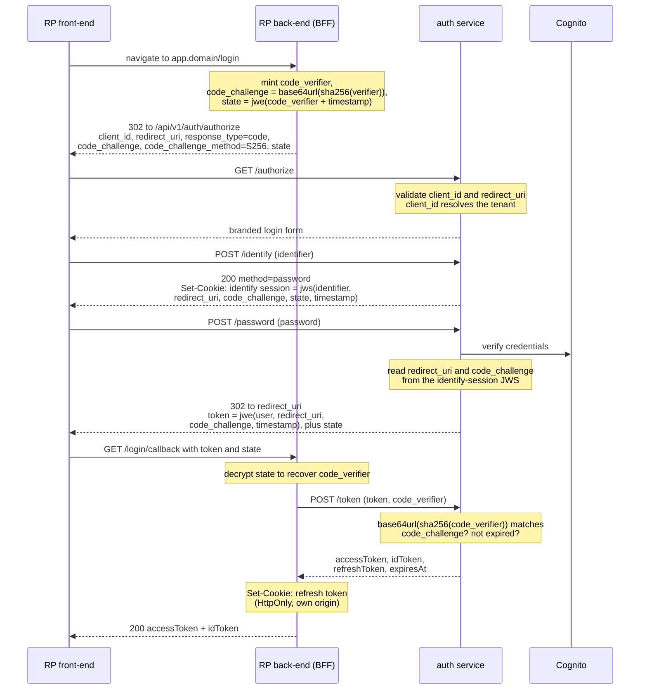

# Vendor-neutral authentication

The auth surface: who talks to whom, what the endpoints are, and how tokens
are issued, delivered, refreshed, elevated and revoked.

No client or relying-party code depends on Cognito's API shapes — no
`X-Amz-Target`, no Cognito envelopes, no Cognito flow names. Everything
crosses the boundary as first-party JSON and redirects. That Cognito is the
engine behind `auth.<zone>` is not a secret; RP backends validate tokens
against its issuer directly.

Why it is shaped this way: [`rationale.md`](./rationale.md). System structure:
[`architecture.md`](./architecture.md). Worked end-to-end scenarios:
`features/` in the `workspace-vlinder-auth` superproject.

## Participants

| Participant | Role |
| --- | --- |
| **RP front-end** | The consuming app's browser code. Navigates to its own `/login`, holds the ID token (and optionally the access token) in memory. |
| **RP back-end (BFF)** | The consuming app's server. Confidential OAuth client: mints PKCE material, exchanges the one-time token, holds the refresh-token cookie. A reference implementation ships in this repo. |
| **auth service** | `auth.<zone>` — the branded login UI plus the `/api/v1/auth` Lambda. The only component that speaks Cognito. |
| **external IdP** | An organisation's own provider (e.g. Google). The auth service is an OIDC *client* to it. |

The admin panel is the one consumer that is same-origin with `auth.<zone>` and
runs no BFF: it rides the AS session cookie directly.

## Identifier-first sign-in

1. The user enters an identifier (email or username).
2. The backend resolves how that identifier authenticates, within the tenant
   the calling `client_id` identified:
   - **Local password** → prompt for a password, submitted to the same API.
   - **Pinned identity provider** → the response names a same-origin location
     for the front-end to navigate to, which emits the real redirect to the
     external provider.
3. Where a tenant pins no provider for the user's email domain, local signup
   and any providers the tenant offers for self-signup are both available.

This is standard home-realm discovery. The identify response is a `200`
carrying a next-step directive in both branches; the federated branch's
directive is a same-origin URL, and the genuine `302` to the external provider
happens there — a `fetch()` response cannot itself perform a top-level
cross-origin navigation.

## API contract (`/api/v1/auth`)

The `/api/v1` prefix is preserved end to end; nothing strips it in transit.

### Layer 1 — RP handoff

- **`GET /api/v1/auth/authorize`** — `client_id`, `redirect_uri` (matched
  against the client's allowlist), `response_type=code`, `scope`, `state`,
  `code_challenge`, `code_challenge_method=S256`. Entry point the RP's
  back-end redirects the browser to. Runs the branded login UI, then mints a
  one-time token and `302`s to `redirect_uri?token=…&state=…`. If the AS
  session cookie already proves an authenticated browser this completes
  silently — that is SSO.
- **`POST /api/v1/auth/token`** — called server-to-server by the BFF. Body
  `{ token, code_verifier }`. Validates the one-time token and PKCE, returns
  `{ accessToken, idToken, refreshToken, expiresAt }`. `redirect_uri` is not
  resent; it is bound inside the one-time token.
- **`POST /api/v1/auth/refresh`** — the BFF forwards its opaque refresh-token
  value unmodified. Returns a fresh access token, a fresh ID token, and a
  newly-encrypted rotated refresh token.

### Layer 2 — login UI

Same-origin, driven by `/authorize`.

- **`POST /api/v1/auth/identify`** — `{ identifier }`. Returns
  `200 { method: "password" }` or
  `200 { method: "redirect", location: "/api/v1/auth/federation?provider=…&action=start" }`.
  Sets the short-lived identify-session cookie.
- **`POST /api/v1/auth/password`** — `{ password }`; the identify session
  rides its cookie. On success establishes the AS session cookie and completes
  the pending `/authorize`. Returns `200 { challenge: … }` for MFA or
  password-change challenges — the backend owns challenge orchestration, not
  the SPA.
- **`GET /api/v1/auth/federation`** — `provider`, `action=start|callback`,
  `intent=signin|signup`. Federation is the resource; the step is a
  parameter. `action=start` redirects to the external provider's own
  authorization endpoint with our client id, our callback, and our own
  `state`/`nonce`. `action=callback` exchanges the provider's code, validates
  its ID token, provisions or links the Cognito user, and completes the
  pending `/authorize`.

### Layer 3 — self-service and lifecycle

- **`GET /api/v1/auth/providers`** — public; providers the tenant offers at
  self-signup, as `[{ id, label }]`. Empty list means signup is local-only.
- **`POST /api/v1/auth/signup` / `/confirm` / `/resend` / `/forgot` /
  `/reset`** — local registration, verification and password reset. The
  verification code is generated and stored by this system.
- **`POST /api/v1/auth/logout`** — `{ everywhere?: boolean }`. Revokes at
  Cognito, then the BFF clears its own cookie.
- **`POST /api/v1/auth/session`** — called directly by a browser with
  credentials, to clear the AS session cookie. Requires CORS for the calling
  origin.
- **`GET /api/v1/auth/whoami`** — the current user as the UI needs them:
  `{ active, held }` privileges re-derived from `user_role_assignments`, plus
  profile attributes that have no business in a token at all (avatar,
  preferences, display name). The privilege half overlaps the ID token; the
  rest does not, which is why this endpoint exists rather than leaving the
  front-end to read everything out of the ID token.
- **`POST /api/v1/auth/sudo`** — activates a held privilege. See
  [Step-up](#step-up-sudo).

## Login



Federation differs only in the middle: `/identify` returns a `redirect`
directive instead of a password prompt, the front-end navigates to
`/federation?action=start`, and the pending `/authorize` completes on
`action=callback` after the provider's code is exchanged and its ID token
validated. The identify-session JWS carries the provider `state` and `nonce`
alongside the RP's own, so the exchange needs no server-side session either.

## Token model

| Token | Contents | Where it lives |
| --- | --- | --- |
| **ID token** | The user's full available scope set. | Front-end memory. Readable by JS — it drives what the UI renders and offers. |
| **Access token** | Only the scopes active for the user's default roles. | Front-end memory *or* a BFF cookie — a per-adopter BFF configuration option. |
| **Refresh token** | JWE-wrapped by the auth service, including any `elevatedGrants`. | An `HttpOnly` cookie on the BFF's own origin. Opaque to the BFF; never reaches JS. |

Scopes travel as a standard space-separated OAuth `scope` claim.

Because the ID token carries a superset of the access token's scopes, **a
resource server must check `token_use` and reject anything that is not an
access token.** Cognito signs both with the same key, so signature, issuer and
expiry checks alone cannot distinguish them.

## Refresh

The BFF reads its own refresh-token cookie, forwards the opaque value
unmodified, and replaces the cookie with the rotated one that comes back.
It never decrypts anything. A refresh that fails because the token expired or
was revoked returns `401`; the BFF clears its cookie and propagates the `401`.

**Consuming front-ends must single-flight refreshes.** Refresh tokens rotate,
so several parallel `401`s each triggering their own refresh will race, trip
Cognito's reuse detection on the superseded token, and revoke the user's whole
token family. Coalescing concurrent refreshes into one in-flight call (an
axios interceptor sharing a single promise, or equivalent) is a requirement,
not an optimisation. The reference BFF and its client helper do this.

## Step-up (sudo)

A role assignment is either active at login or **held** — granted, but
contributing nothing until deliberately activated. New grants are held by
default, so granting a role never silently widens someone's everyday access.

The front-end learns what is held either by diffing the ID token's scopes
against the access token's, or from `GET /api/v1/auth/whoami`, which
re-derives `{ active, held }` from `user_role_assignments`. `/whoami` is also
the authority when the two could disagree: it reflects grants changed
server-side mid-session, which a token minted earlier cannot.

A resource server rejecting a call for a held privilege must say so
explicitly:

```json
403 { "error": "insufficient_privilege",
      "privilege": "refund:acme-corp:orders/**",
      "escalatable": true }
```

Without that flag the front-end would have to guess whether any given `403` is
step-up-fixable, which it cannot — ownership checks, rate limits and
never-granted privileges all look the same from outside.

Activation depends on how the session authenticated, which the AS session
records:

- **Local password session** — a redirect to an `auth.<zone>`-hosted
  confirmation flow, structurally the login flow in miniature (the BFF mints
  its own PKCE material and `state`, naming the target privilege). The auth
  service presents its own password form, validates it, confirms the grant is
  actually held, and redirects back with a one-time token the BFF exchanges as
  usual. The password is never collected by the RP's own UI, and never in an
  iframe.
- **Federated session** — an in-app confirmation dialog, then
  `POST /api/v1/auth/sudo { privilege }` relayed by the BFF. No
  re-authentication is possible at the external provider, so intent is
  confirmed rather than identity re-proven.

Either way the auth service re-checks the grant against
`user_role_assignments` — activation activates an existing grant, it never
creates one — and returns a fresh access token carrying the privilege plus a
rotated refresh token whose payload gains:

```json
"elevatedGrants": [
  { "privilege": "refund:acme-corp:orders/**", "expiresAt": 1767225600 }
]
```

Grants are per-privilege and decay by wall-clock expiry. Every refresh drops
expired entries, computes the access token's scopes as
`default ∪ still-live elevated grants`, and carries the trimmed list forward.
Expiry is therefore silent: no error, no notification, and the next attempt at
the action returns the same escalatable `403` as before. Re-running `/sudo`
for an already-elevated privilege resets its expiry rather than stacking.

## Logout

Ordinary logout is scoped to the requesting app. The BFF forwards its opaque
refresh-token cookie; the auth service revokes that refresh token at Cognito;
the BFF clears its cookie. The `auth.<zone>` SSO session stays intact, so the
user's other apps are unaffected.

`{ everywhere: true }` additionally calls `GlobalSignOut`, invalidating every
refresh token issued to that user across every client. Ending SSO also
requires the front-end to make one direct, credentialed call to
`POST /api/v1/auth/session` — the AS session cookie is scoped to
`auth.<zone>`'s origin, and only a request the browser itself makes there can
clear it.

**Neither reaches an external identity provider's own session.** If a user's
provider session is still live, the next login silently re-authenticates. This
gap is documented and accepted; see [`rationale.md`](./rationale.md).

An administrator can terminate all of a user's sessions from the admin panel
and its API, independently of anything the user does.

## What an adopter must implement

The reference BFF in this repo implements all of it; this is the checklist for
anyone building their own.

- Mint `code_verifier`/`code_challenge` and an encrypted `state` per login;
  never in front-end code.
- Exchange the one-time token server-to-server; never expose `/token` to the
  browser.
- Store the refresh token as an `HttpOnly`, `Secure`, `SameSite` cookie on the
  app's own origin, opaque and unmodified.
- Single-flight refreshes.
- Relay `/sudo`, `/whoami` and `/logout` rather than exposing `auth.<zone>`
  credentials to the front-end.
- Validate `token_use` on every access token the app's own resource servers
  accept, and return `escalatable` on privilege failures.
- Decide whether the access token is exposed to front-end JavaScript, and
  configure the BFF accordingly.
